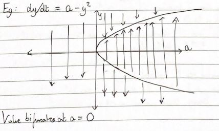

### *From Problem Set 4: Exercise 1.1*

First, we must consider an autonomous ODE which, while independent of the independent variable (say it is t in this case), still is a function that is dependent on some parameter (say it is a in this case).

Let us construct the general form of such an autonomous ODE, which would look like , where a is some real parameter.

For this ODE, the critical points are constructed in such a way that their existence and values are dependent on a. This means that they are behaving as functions of a.

As a increases or decreases, or even attains a specific value, the value and number/nature of the critical points may vary.

The critical points may come together to form one mutual point, or they may separate into two different entities. This shows us that the points of equilibriamay be generated or lost by the simple variation in the a variable.

The splitting behavior occurs at what is called the bifurcation point.

The bifurcation diagram helps us to visualize this splitting behavior and the related equilibria (including the number and nature of these). 

The diagram is a plot of a and y that explains the equilibria as well as the presence of these points.

Through the use of the arrows, analogous to those used in the phase line diagrams, it depicts the nature of equilibria, namely quantifying theme to be semi stable, stable or unstable.

An example is shown below:

